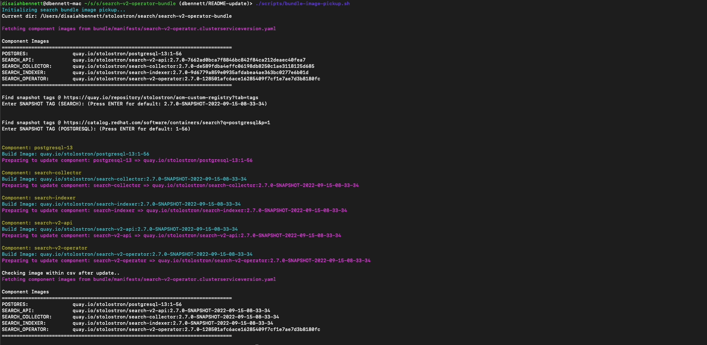
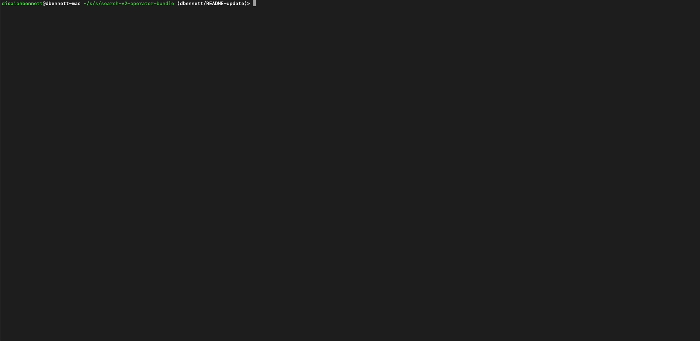

# This project is deprecated.
- Please see: https://github.com/stolostron/search-v2-operator
- The last RHACM release using this project is RHACM 2.8

# Search Operator Bundle

Bundles the latest Odyssey (OCM Search v2) components.

## Image Pickup

> Pre-requisites:
>
> - You will need a `GITHUB_TOKEN` that provides read access from the [stolostron/pipeline](https://github.com/stolostron/pipeline) (private) repository (required to fetch the latest image manifests).
> - jq command - [link](https://formulae.brew.sh/formula/jq)
> - yq command - [link](https://formulae.brew.sh/formula/yq)
> - When running the update manually, you will need to ensure that the `snapshot.ver` and `pg-snapshot.ver` file exist within the `search-v2-operator-bundle` repository.

When bundling the latest build, the following `Search` images will be targeted (unless ignored):

- [search-collector](https://github.com/stolostron/search-collector)
- [search-indexer](https://github.com/stolostron/search-indexer)
- [search-v2-api](https://github.com/stolostron/search-v2-api)
- [search-v2-operator](https://github.com/stolostron/search-v2-operator)

The following `Postgresql` image will be targeted (unless ignored):

- [postgresql-13](https://catalog.redhat.com/software/containers/rhel8/postgresql-13/5ffdbdef73a65398111b8362)

### Running the bundle update locally

When executing the script, you will be prompted to select the `SNAPSHOT` tag for the `Search` and `Postgresql` images. By default, this project support the usage of the `snapshot.ver` and `pg-snapshot.ver` file.

The default tag version for the `Search` components will be located within the `snapshot.ver`. To verify that the file exist, run the following command:

```bash
# 2.7.0-SNAPSHOT-2022-09-15-08-33-34
cat ./snapshot.ver
```

The default tag version for the `Postgresql` component will be located within the `pg-snapshot.ver`. To verify that the file exist, run the following command:

```bash
# 1-78
cat ./pg-snapshot.ver
```

To continue with the default tags that are set within the repository, simply press `enter` or `return`; otherwise, you can fetch the required `SNAPSHOT` tag to use from the [quay.io/stolostron](https://quay.io/organization/stolostron) registry.



**NOTE**: The default image tags that are being used within the `snapshot.ver` and `pg-snapshot.ver` will only be updated after running the script `manually`. If the user execute the script while silent mode is enabled, the `snapshot` files will not be updated with the latest image tags.

### Running the bundle update in silent mode

For automatic updates, the user can run the script in `silent` mode. When running the script within `silent` mode, the user will need to ensure that they have access to the pipeline repository, from which the latest images will be fetched from. The user will also need to export their github token as the following environment variable: `GITHUB_TOKEN`.

To run the script within silent mode, add the `--silent` or `-s` flag at the end of the command to ensure that the mode is enabled.

```bash
./scripts/bundle-image-pickup.sh --silent

or 

./scripts/bundle-image-pickup.sh -s
```



### TODO: Scheduling bundle update with Github actions workflow

Details to be added...

### Environment Variables

Each environment variable is customizable and can be set by the user.

| Name                          | Description                                                        | Default Value                                               |
|-------------------------------|--------------------------------------------------------------------|-------------------------------------------------------------|
| IMG_REGISTRY                  | Image registry from where the build image will be pulled from      | quay.io/$ORG                                                |
| IGNORE_API_IMAGE_UPDATE       | Ignore search-v2-api image update                                  | false                                                       |
| IGNORE_COLLECTOR_IMAGE_UPDATE | Ignore search-collector image update                               | false                                                       |
| IGNORE_INDEXER_IMAGE_UPDATE   | Ignore search-indexer image update                                 | false                                                       |
| IGNORE_OPERATOR_IMAGE_UPDATE  | Ignore search-v2-operator image update                             | false                                                       |
| IGNORE_POSTGRES_IMAGE_UPDATE  | Ignore postgresql-13 image update                                  | true                                                        |
| OPERATOR_CONTAINER_PATH       | The container path within the search-v2-operator.clusterserviceversion manifest file | .spec.install.spec.deployments[0].spec.template.spec.containers[1] |
| OPERATOR_CSV_FILEPATH         | The search-v2-operator.clusterserviceversion manifest file path | bundle/manifests/search-v2-operator.clusterserviceversion.yaml |
| OPERATOR_ENV_PATH             | The container env path within the search-v2-operator.clusterserviceversion manifest file   | OPERATOR_CONTAINER_PATH.env[].value |
| OPERATOR_IMAGE_PATH           | The container image path within the search-v2-operator.clusterserviceversion manifest file | OPERATOR_CONTAINER_PATH.image       |
| ORG                           | The org from which the images will be pulled from and where the manifest file will be fetched from | stolostron                  |
| PIPELINE_REPO                 | The repository that contains the image manifest file                     | pipeline                                              |
| POSTGRES_IMG_REGISTRY         | The image registry for the postgresql component                          | $IMG_REGISTRY                                         |
| README_FILEPATH               | The README filepath for where the updated status will be added           | README.md                                             |
| RELEASE_BRANCH                | The release branch from which the pipeline manifest will be fetched from | 2.7-integration                                       |
| SEARCH_API_IMG_REGISTRY       | The image registry for the search-v2-api component                       | $IMG_REGISTRY                                         |
| SEARCH_COLLECTOR_IMG_REGISTRY | The image registry for the search-collector component                    | $IMG_REGISTRY                                         |
| SEARCH_INDEXER_IMG_REGISTRY   | The image registry for the search-indexer component                      | $IMG_REGISTRY                                         |
| SEARCH_OPERATOR_IMG_REGISTRY  | The image registry for the search-v2-operator component                  | $IMG_REGISTRY                                         |

## Links

These are a few useful links that will help provide technical reference and best practices when developing for the platform.

- [jq Docs](https://stedolan.github.io/jq/tutorial/)
- [yq Docs](https://mikefarah.gitbook.io/yq/)

Image Rebuild: Thu Sep 15 13:21:16 EDT 2022
